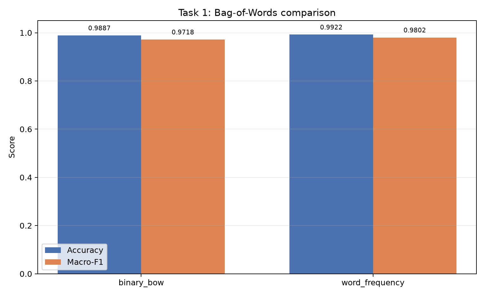
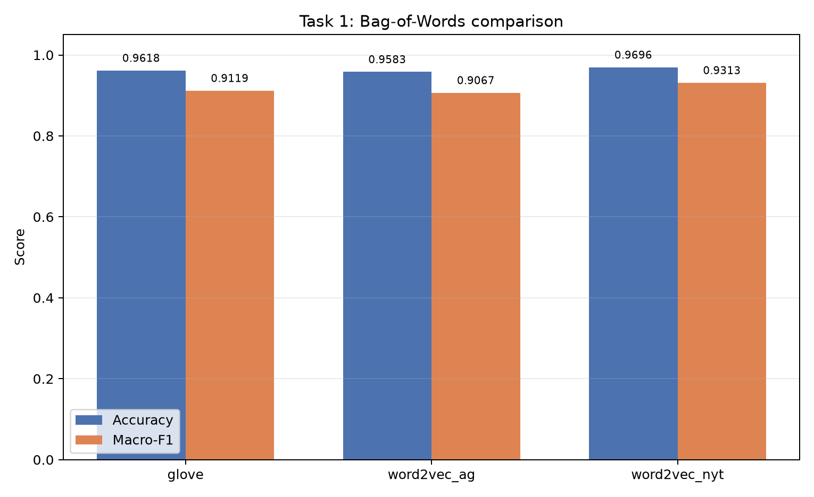
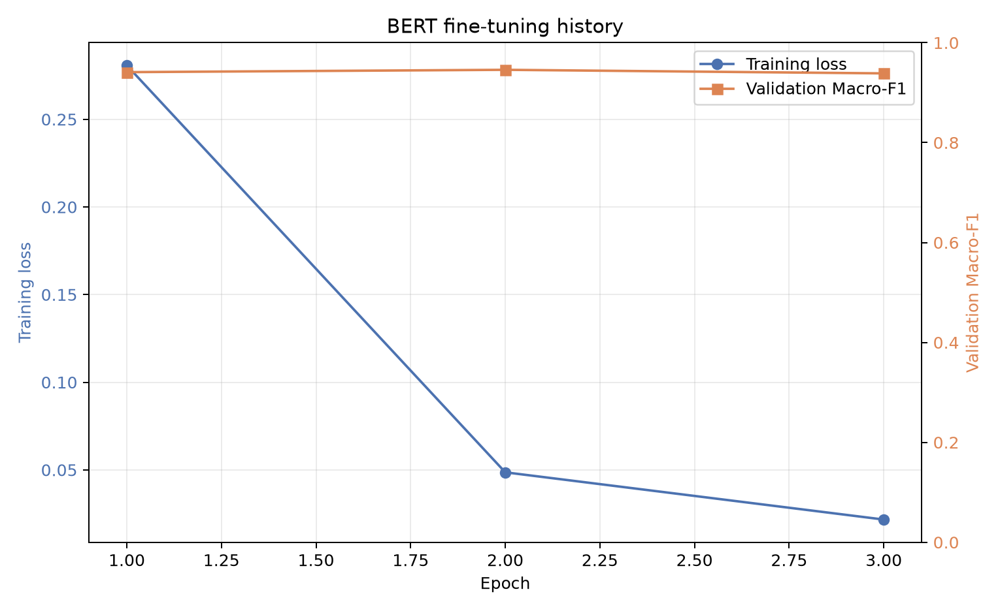

# 自然语言处理实验一：文本分类

本仓库根据实验要求完成 NYT 新闻三分类实验，比较传统词袋模型、词向量表示和 BERT 预训练语言模型。当前采用逐实验完成、逐实验记录结果的方式；最终再统一生成汇总实验报告 PDF。

## 当前完成状态

- [x] Experiment 1：Bag-of-Words（2 种表示）
- [x] Experiment 2：Word2Vec / GloVe（3 种表示）
- [x] Experiment 3：BERT 微调
- [x] 最终汇总报告与 PDF（`report/实验报告.pdf`）

## 实验约定

- 数据集：`HW-1/nyt.csv`，共 11,519 条，标签为 `business`、`politics`、`sports`。
- 数据划分：简单的分层随机划分，Training/Validation/Test = 80%/10%/10%，随机种子为 42。
- BoW 和 Word2Vec 使用统一分词：小写化、NLTK Treebank 分词、删除纯标点 token。
- 词表和统计量只从 Training Set 获得。
- 所有实验使用同一个划分函数，最终只在 Test Set 上报告 Accuracy 和 Macro-F1。
- 测试集不参与模型选择和反复调参。

详细实验约定见 [`EXPERIMENT_GUIDE.md`](EXPERIMENT_GUIDE.md)。

## 实验环境

本仓库使用项目内的 Python 3.13 虚拟环境 `submission/.venv-bert` 运行全部实验，实际版本如下：

| 组件 | 版本 |
|---|---|
| 操作系统 | Windows 11 |
| GPU | NVIDIA GeForce RTX 4060 Laptop GPU (8GB) |
| CUDA | 12.8 |
| Python | 3.13.9 (Anaconda base, venv) |
| NumPy | 2.5.3 |
| pandas | 3.0.6 |
| SciPy | 1.18.1 |
| scikit-learn | 1.9.1 |
| NLTK | 3.10.3 |
| Matplotlib | 3.11.2 |
| Seaborn | 0.13.2 |
| gensim | 4.4.0 |
| PyTorch | 2.11.0+cu128 |
| Transformers | 5.17.0 |
## 项目结构

```text
submission/
├─ README.md
├─ EXPERIMENT_GUIDE.md
├─ requirements.txt
├─ run_all.ps1
├─ .gitignore
├─ data/
│  ├─ nyt.csv
│  └─ ag.csv
├─ src/
│  ├─ common.py
│  ├─ task1_bow.py
│  ├─ task2_word2vec.py
│  └─ task3_bert.py
├─ scripts/
│  ├─ bootstrap.ps1
│  └─ download_assets.ps1
└─ outputs/
   ├─ task1/
   ├─ task2/
   └─ task3/
```

## 快速开始（一键运行）

在 PowerShell 中进入 `submission` 目录：

```powershell
cd submission
.\run_all.ps1
```

`run_all.ps1` 会自动完成：

1. 创建虚拟环境 `submission/.venv-bert`；
2. 安装 `requirements.txt` 中的依赖和 CUDA 版 PyTorch；
3. 下载 GloVe 100d 与 BERT 权重；
4. 依次运行 Task 1、Task 2、Task 3；
5. 将结果写入 `outputs/`。

也可以分步执行：

```powershell
# 1. 准备环境
.\scripts\bootstrap.ps1

# 2. 下载资源
.\scripts\download_assets.ps1

# 3. 分别运行
.\.venv-bert\Scripts\python.exe src\task1_bow.py
.\.venv-bert\Scripts\python.exe src\task2_word2vec.py
.\.venv-bert\Scripts\python.exe src\task3_bert.py --model-name cache\bert-base-uncased-local
```

## 环境配置（重要）

> 本仓库**必须使用虚拟环境** `submission/.venv-bert` 运行。请勿直接使用 Anaconda 基础环境的 `python`，否则会出现 scipy / scikit-learn 版本冲突。

| 配置项 | 说明 |
|---|---|
| 虚拟环境 | `submission/.venv-bert`，与 Anaconda 基础环境隔离 |
| 运行解释器 | `.\.venv-bert\Scripts\python.exe` |
| 基础解释器 | 自动探测：优先 `py -3.13` / `py -3`，其次 `python` |
| 操作系统 | Windows 11 + PowerShell |
| GPU | NVIDIA GeForce RTX 4060 Laptop GPU (8GB) |
| CUDA | 12.8 |
| Python | 3.13.9 |
| PyTorch | 2.11.0+cu128（CUDA 版） |
| Transformers | 5.17.0 |
| scikit-learn | 1.9.1 |
| gensim | 4.4.0 |
| NLTK | 3.10.3 |

**安装与运行：**

```powershell
# 1. 创建虚拟环境并安装依赖
.\scripts\bootstrap.ps1

# 2. 下载 GloVe 和 BERT 权重
.\scripts\download_assets.ps1

# 3. 分别运行三个实验（必须使用虚拟环境解释器）
.\.venv-bert\Scripts\python.exe src\task1_bow.py
.\.venv-bert\Scripts\python.exe src\task2_word2vec.py
.\.venv-bert\Scripts\python.exe src\task3_bert.py --model-name cache\bert-base-uncased-local
```

**注意事项：**

1. `scripts/bootstrap.ps1` 会自动探测 Python 3.10+（优先 3.13）。若自动探测失败，再手动修改脚本中的 `$BasePython`。
2. 没有 NVIDIA GPU 时，把 `scripts/bootstrap.ps1` 中 PyTorch 安装命令改为 CPU 版，并将 `src/task3_bert.py` 的 `device` 逻辑保持自动回退到 CPU。
3. Hugging Face 模型通过 `HF_ENDPOINT=https://hf-mirror.com` 访问；BERT 权重经 ModelScope 的 `AI-ModelScope/bert-base-uncased` 下载，该仓库与 `google-bert/bert-base-uncased` 是同一模型。
4. 数据优先读取 `submission/data/`，若不存在则回退到 `submission/../HW-1/`。
5. GloVe 只解压 `glove.6B.100d.txt`，避免占用其他维度文件的额外空间。
## GitHub 提交说明

- 代码、README、结果图表和实验报告均纳入 Git；
- `cache/`、`.venv-bert/`、`__pycache__/`、各任务 `predictions.csv` 和 Word2Vec 模型文件已通过 `.gitignore` 排除；
- 数据集 `data/` 体积约 65MB，两个 CSV 文件均小于 GitHub 的 100MB 单文件限制，可以直接提交；
- 提交前请在仓库根目录执行一次 `git init`、`git add .`、`git commit`，然后将远程地址推送到 GitHub。
# Experiment 1：Bag-of-Words

## 1. 实验目标

使用两种 Bag-of-Words 表示训练文本分类器，比较二值出现信息与词频信息在 NYT 三分类任务上的差异：

1. Binary Bag-of-Words：词在文档中出现记 1，否则记 0。
2. Word Frequency：记录每个词在文档中的出现次数。

两种方法均使用 Logistic Regression 作为分类器。

说明：实验要求中的“三种 Bag-of-Words”属于笔误，其后实际只列出两种方法。根据老师补充说明，本实验按两种方法完成。

## 2. 数据与划分

### 2.1 数据规模

| 类别 | 样本数 | 占比 |
|---|---:|---:|
| business | 1,429 | 12.40% |
| politics | 1,451 | 12.60% |
| sports | 8,639 | 74.99% |
| 合计 | 11,519 | 100% |

NYT 文本长度统计：

| 统计量 | 值 |
|---|---:|
| 平均 token 数 | 646.01 |
| 中位数 token 数 | 681 |
| 95% 分位 token 数 | 1,026 |
| 最大 token 数 | 5,204 |
| 空文档数 | 0 |

### 2.2 数据划分

采用 `train_test_split` 两次划分：

- Training Set：9,215 条；
- Validation Set：1,152 条；
- Test Set：1,152 条。

| 类别 | Training | Validation | Test |
|---|---:|---:|---:|
| business | 1,143 | 143 | 143 |
| politics | 1,161 | 145 | 145 |
| sports | 6,911 | 864 | 864 |

## 3. 方法实现

### 3.1 预处理

1. 将文本转换为小写；
2. 使用 NLTK `TreebankWordTokenizer` 分词；
3. 删除不含字母或数字的纯标点 token；
4. 保留数字及混合 token；
5. 使用训练集学习词表，验证集和测试集只做映射，不扩充词表。

### 3.2 文本表示

词表大小为 142,077。每篇文档表示为 142,077 维稀疏向量：

- Binary BoW：仅保留 0/1，忽略出现次数；
- Word Frequency：保留每个词的出现次数。

### 3.3 分类模型

两种方法使用完全相同的 Logistic Regression 配置：

```text
C=1.0
max_iter=2000
solver="lbfgs"
random_state=42
```

## 4. 实验结果

### 4.1 总体指标

| 表示方法 | Validation Accuracy | Validation Macro-F1 | Test Accuracy | Test Macro-F1 | 错分数 |
|---|---:|---:|---:|---:|---:|
| Binary Bag-of-Words | 0.9818 | 0.9562 | **0.9887** | **0.9718** | 13 |
| Word Frequency | 0.9809 | 0.9576 | **0.9922** | **0.9802** | 9 |

Word Frequency 的 Test Accuracy 比 Binary BoW 高约 0.35 个百分点，Macro-F1 高约 0.83 个百分点。两者在验证集上的差距很小，但 Word Frequency 在测试集上的表现更好，且错分样本从 13 条减少到 9 条。



### 4.2 分类别结果

Binary Bag-of-Words：

| 类别 | Precision | Recall | F1-score | Support |
|---|---:|---:|---:|---:|
| business | 0.9514 | 0.9580 | 0.9547 | 143 |
| politics | 0.9653 | 0.9586 | 0.9619 | 145 |
| sports | 0.9988 | 0.9988 | 0.9988 | 864 |

Word Frequency：

| 类别 | Precision | Recall | F1-score | Support |
|---|---:|---:|---:|---:|
| business | 0.9527 | 0.9860 | 0.9691 | 143 |
| politics | 0.9858 | 0.9586 | 0.9720 | 145 |
| sports | 1.0000 | 0.9988 | 0.9994 | 864 |

### 4.3 混淆矩阵

Binary Bag-of-Words：

```text
              predicted
true          business  politics  sports
business          137         5       1
politics             6       139       0
sports               1         0     863
```

Word Frequency：

```text
              predicted
true          business  politics  sports
business          141         2       0
politics             6       139       0
sports               1         0     863
```

混淆矩阵保存在：

- `outputs/task1/binary_bow/test_confusion_matrix.png`
- `outputs/task1/word_frequency/test_confusion_matrix.png`

## 5. 结果分析

### 5.1 为什么 Word Frequency 略好

Binary BoW 只关心词是否出现。一个词在文档中出现一次还是十次，表示完全相同；Word Frequency 则保留重复带来的强度信息。在新闻分类中，某个主题词反复出现通常能够增强类别判断，例如商业报道中反复出现 `market`、`company`、`oil`、`bank` 等词。

Word Frequency 对 business 类提升最明显：binary 的 business recall 为 95.80%，Word Frequency 提升到 98.60%，business 的 F1 从 95.47% 提升到 96.91%。这说明保留词频后，模型能将一部分原本误判为 politics 的商业新闻重新识别为 business。

不过，两者在 validation 上的 Macro-F1 只相差约 0.15 个百分点，说明词频带来的优势不是所有数据划分上都非常稳定。测试集上的提升应该结合实际任务和误差分布解释，不能仅凭一次实验夸大差异。

### 5.2 类别不平衡的影响

sports 有 864 条测试样本，而 business 和 politics 分别只有 143、145 条。模型对 sports 的 F1 接近 99.9%，因此整体 Accuracy 很高。但 Macro-F1 低于 Accuracy，原因就是评价时三个类别权重相同，少数类错误会对 Macro-F1 造成更明显的下降。

两种方法的错误主要集中在 business 和 politics 之间：

- Binary BoW：6 条 politics 被判为 business，5 条 business 被判为 politics；
- Word Frequency：6 条 politics 被判为 business，2 条 business 被判为 politics；
- sports 只有 1 条错误。

这说明 sports 的词汇特征与另外两类差异很大，而 business 与 politics 同属公共事务新闻，词汇和主题存在重叠，是主要难点。

### 5.3 重要词特征

Logistic Regression 的正系数表示词对某个类别有更强的正贡献。Word Frequency 模型中：

- business 的高权重词包括 `company`、`european`、`flight`、`oil`、`fed`、`bp`、`union`、`bank`、`government`、`market`；
- politics 的高权重词包括 `mr.`、`washington`、`republican`、`texas`、`law`、`military`、`obama`、`officials`、`guns`、`justice`；
- sports 的高权重词包括 `game`、`league`、`players`、`team`、`football`、`club`、`open`、`player`、`season`、`round`。

这些特征符合新闻类别的直觉。需要注意，系数大小表示模型内部的判别信息，并不等价于严格的因果解释。

## 6. 结论

1. Binary BoW 和 Word Frequency 都能在 NYT 上取得较高效果，说明词的出现模式已经包含很强的类别信息。
2. Word Frequency 在本实验中整体优于 Binary BoW，主要改善了 business 类的判别效果。
3. 两种方法的主要错误都发生在 business 和 politics 之间，反映了类别主题重叠带来的困难。
4. 由于类别不平衡，Accuracy 容易被数量最多的 sports 拉高，因此必须结合 Macro-F1 和分类别指标判断模型质量。
5. BoW 的局限是没有语序和上下文信息，后续 Word2Vec 与 BERT 实验将进一步比较不同表示方式的表现。

## 7. 复现方式

Experiment 1 的独立运行命令：

```powershell
E:\anaconda\python.exe submission\src\task1_bow.py
```

脚本默认读取 `HW-1/nyt.csv`，并将结果写入 `submission/outputs/task1/`。

主要输出文件：

- `comparison.csv`：两种方法的总体指标；
- `comparison.png`：Accuracy 和 Macro-F1 对比图；
- `dataset_summary.json`：数据分布与划分信息；
- `error_overlap.json`：两种方法错分集合的重合统计；
- `binary_bow/`、`word_frequency/`：各自完整的分类报告、混淆矩阵和错分案例。

---

# Experiment 2：Word2Vec / GloVe

## 1. 实验目标

使用三种 100 维词向量表示文档，并比较不同词向量来源对 NYT 三分类的影响：

1. Pre-trained GloVe 6B 100d；
2. 在 AG News 上训练的 Word2Vec 100d；
3. 在 NYT Training Set 上训练的 Word2Vec 100d。

每篇文档的词向量通过所有有效词的算术平均得到，分类器统一使用与 Task 1 相同的 Logistic Regression。

## 2. 实验设置

### 2.1 Word2Vec 参数

| 参数 | 值 |
|---|---:|
| vector_size | 100 |
| window | 5 |
| min_count | 5 |
| 训练结构 | Skip-gram（sg=1） |
| negative | 5 |
| sample | 0.001 |
| epochs | 5 |
| workers | 4 |
| seed | 42 |

AG News 使用全部 90,000 条文本训练；NYT Word2Vec 只使用 9,215 条 Training Set 文本训练。Validation Set 和 Test Set 不参与词向量训练，避免表示学习阶段的数据泄漏。

### 2.2 文档向量

对于一篇文档的 token 序列 `w1, ..., wn`，只保留词向量中存在的有效词，然后取平均：

```text
document_vector = mean(vector(w1), ..., vector(wn))
```

如果某篇文档没有任何有效词，则使用 100 维零向量。本实验中三种表示都没有出现全零文档。

## 3. 实验结果

### 3.1 总体指标

| 表示方法 | Validation Accuracy | Validation Macro-F1 | Test Accuracy | Test Macro-F1 | 错分数 |
|---|---:|---:|---:|---:|---:|
| GloVe 6B 100d | 0.9488 | 0.8939 | **0.9618** | **0.9119** | 44 |
| Word2Vec on AG News | 0.9375 | 0.8675 | **0.9583** | **0.9067** | 48 |
| Word2Vec on NYT | 0.9514 | 0.8930 | **0.9696** | **0.9313** | 35 |

NYT Word2Vec 的测试 Macro-F1 最高，为 93.13%；GloVe 为 91.19%；AG News Word2Vec 为 90.67%。三种表示都取得了较高 Accuracy，但 Macro-F1 明显低于 Accuracy，说明少数类的分类难度仍然更大。



### 3.2 分类别 F1

| 表示方法 | business F1 | politics F1 | sports F1 |
|---|---:|---:|---:|
| GloVe 6B 100d | 0.8858 | 0.8592 | 0.9908 |
| Word2Vec on AG News | 0.8811 | 0.8509 | 0.9880 |
| Word2Vec on NYT | **0.9053** | **0.8968** | **0.9919** |

NYT Word2Vec 在三个类别上均取得最高的 F1。和 Task 1 的词袋模型相比，三种词向量的 sports F1 仍在 98.8% 以上，但 business 和 politics 的 F1 明显下降，说明平均词向量对这两类新闻的区分能力弱于高维稀疏词袋。

### 3.3 OOV 与有效词统计

| 表示方法 | 向量表大小 | Test token 覆盖率 | Test OOV 类型率 | 平均有效词数 |
|---|---:|---:|---:|---:|
| GloVe 6B 100d | 400,000 | 95.40% | 36.58% | 628.52 |
| Word2Vec on AG News | 26,072 | 92.76% | 63.59% | 611.08 |
| Word2Vec on NYT | 34,765 | 96.86% | 43.74% | 638.11 |

这里的 token 覆盖率按 token 出现次数计算，OOV 类型率按测试集中不同词类型计算。AG News Word2Vec 的词表最小、测试 token 覆盖率最低，而且 OOV 类型率最高，存在更明显的领域和词表不匹配。

### 3.4 混淆矩阵

GloVe：

```text
              predicted
true          business  politics  sports
business          128        12       3
politics           16       119      10
sports               2         1     861
```

Word2Vec on AG News：

```text
              predicted
true          business  politics  sports
business          126        12       5
politics           15       117      13
sports               2         1     861
```

Word2Vec on NYT：

```text
              predicted
business          129        10       4
politics           11       126       8
sports               2         0     862
```

混淆矩阵图片保存在各方法目录的 `test_confusion_matrix.png` 中。

## 4. 结果分析

### 4.1 为什么 NYT Word2Vec 最好

NYT Word2Vec 的训练语料与测试任务来自同一数据领域，因此它学到的词与词关系更接近 NYT 新闻的表达方式。其测试 token 覆盖率达到 96.86%，平均每篇文档有 638.11 个有效词，均为三种表示中最高。

较高的覆盖率和领域一致性使文档平均向量更稳定，因此它在 business、politics 和 sports 上的 F1 都高于另外两种表示。

### 4.2 为什么 AG News Word2Vec 最弱

AG News Word2Vec 的词表只有 26,072 个词，测试 token 覆盖率为 92.76%，OOV 类型率为 63.59%。这说明 NYT 中许多词没有在 AG News 词表中出现，或者出现频率不足 5 次而被 `min_count` 过滤。

虽然 AG News 也是新闻语料，但它是较短的新闻标题或摘要，NYT 文本通常更长、更复杂，且两者在词汇使用和主题构成上存在差异。因此 AG News 训练的词向量与 NYT 的匹配程度低于 NYT 自身训练的向量。

### 4.3 GloVe 与 AG News Word2Vec 的比较

GloVe 使用 400,000 个词的通用预训练词表，测试 token 覆盖率达到 95.40%，明显高于 AG News Word2Vec。较大的通用词汇覆盖使 GloVe 在 NYT 上具有更稳定的平均文档表示，因此其 Macro-F1 略高于 AG News Word2Vec。

不过，GloVe 是在通用语料上训练的，不一定专门强调新闻分类所需的领域信息，因此仍然低于 NYT 领域内训练的 Word2Vec。

### 4.4 为什么仍然低于 Bag-of-Words

从直观上看，词向量包含语义信息，应该可能优于词袋；但本实验结果相反，主要有以下原因：

1. 当前任务只有三个类别，且类别之间存在较强的关键词差异，词袋模型可以直接利用 `game`、`team`、`washington`、`company`、`market` 等具体词汇。
2. 平均池化把整篇文档压缩为 100 维向量，丢失了词序、短语结构和关键词位置信息。长新闻包含大量与主题无关的内容，平均后容易稀释真正的类别特征。
3. 静态词向量对同一个词只给出一个向量，无法区分多义词在不同上下文中的含义。
4. 高维稀疏词袋虽然简单，但在这类数据量不大、类别词特征明显的任务中非常有效。
5. 词向量的优势可能在类别更复杂、长尾词更多或训练数据更大的任务中更明显；在本实验中并未超过词袋基线。

### 4.5 类别不平衡与错误分布

三种表示的主要错误仍然集中在 politics 和 business 之间，例如 politics 被预测为 business，或 business 被预测为 politics。两类新闻都可能涉及政府、政策、经济、法律和商业活动，词向量平均后容易混合这些主题。

此外，平均词向量还出现了将部分 politics 预测为 sports 的错误，以及少量 business 预测为 sports 的错误。这说明仅仅平均词向量会丢失句子结构，模型可能被文档中少数高频主题词误导。

## 5. 结论

1. 三种 100 维词向量都能完成 NYT 三分类，但整体 Macro-F1 低于 Task 1 的 Bag-of-Words 模型。
2. NYT Word2Vec 在三种词向量中表现最好，支持“领域内训练更适配目标任务”的解释。
3. AG News Word2Vec 的词表覆盖不足，OOV 比例最高，是当前表现相对较弱的重要原因之一。
4. GloVe 的词表覆盖广，因而优于 AG News Word2Vec，但领域适配程度不如 NYT Word2Vec。
5. 平均词向量丢失词序和具体关键词强度，长新闻的特征稀释是传统词袋仍占优势的重要原因。
6. 后续 BERT 通过上下文表示和端到端微调，理论上可以弥补平均词向量的上下文信息缺失。

## 6. 复现方式

Experiment 2 的运行命令：

```powershell
.\.venv\Scripts\python.exe src\task2_word2vec.py
```

首次运行需要准备：

```text
submission/cache/glove/glove.6B.100d.txt
```

脚本会自动生成 AG News 与 NYT Word2Vec 模型。使用 `--force-retrain` 可以强制重新训练词向量。

---

# Experiment 3：BERT

## 1. 实验目标

使用预训练语言模型 `google-bert/bert-base-uncased` 直接完成 NYT 三分类，观察上下文相关表示与端到端微调相比传统词袋和平均词向量的效果。

## 2. 实验设置

| 项目 | 配置 |
|---|---|
| 预训练模型 | `google-bert/bert-base-uncased` |
| 分类层 | BERT 分类头，`num_labels=3` |
| 最大序列长度 | 64 |
| 训练轮数 | 3 epochs |
| Batch size | 32 |
| 优化器 | AdamW |
| 学习率 | 2e-5 |
| Weight decay | 0.01 |
| Warmup ratio | 0.10 |
| 梯度裁剪 | 1.0 |
| 调度器 | Linear warmup + linear decay |
| 随机种子 | 42 |

模型权重来自 `google-bert/bert-base-uncased` 的镜像版本。由于当前网络无法直接访问 Hugging Face 的 Xet CDN，本实验通过 ModelScope 下载与官方完全相同的 BERT 权重，并记录在环境说明中。

## 3. 实验结果

### 3.1 总体指标

| 指标 | 值 |
|---|---:|
| Test Accuracy | **0.9852** |
| Test Macro-F1 | **0.9684** |
| 最佳 epoch | 2 |
| 最佳 Validation Macro-F1 | 0.9457 |
| 错分样本数 | 17 |
| 训练总耗时 | 约 239 秒 |

### 3.2 逐轮训练记录

| Epoch | Train Loss | Validation Loss | Validation Accuracy | Validation Macro-F1 |
|---:|---:|---:|---:|---:|
| 1 | 0.2807 | 0.0819 | 0.9731 | 0.9411 |
| 2 | 0.0486 | 0.0835 | 0.9748 | **0.9457** |
| 3 | 0.0217 | 0.0986 | 0.9714 | 0.9386 |

训练到第 2 个 epoch 时验证集 Macro-F1 最高，第 3 个 epoch 验证损失开始上升，说明继续训练出现过拟合迹象。最终测试采用第 2 个 epoch 保存的模型。



### 3.3 分类别结果

| 类别 | Precision | Recall | F1-score | Support |
|---|---:|---:|---:|---:|
| business | 0.9643 | 0.9441 | 0.9541 | 143 |
| politics | 0.9459 | 0.9655 | 0.9556 | 145 |
| sports | 0.9954 | 0.9954 | 0.9954 | 864 |

### 3.4 混淆矩阵

```text
              predicted
true          business  politics  sports
business          135         6       2
politics             3       140       2
sports               2         2     860
```

混淆矩阵图片位于 `outputs/task3/test_confusion_matrix.png`。

### 3.5 截断统计

由于 `max_length=64`，几乎所有样本都被截断：

| 数据集 | 平均 token 数 | 超过 64 token 的比例 |
|---|---:|---:|
| Training | 833.44 | 99.95% |
| Validation | 831.13 | 100.00% |
| Test | 851.56 | 100.00% |

这里的 token 数是 BERT WordPiece Tokenizer 切分后的长度。NYT 新闻通常较长，而本实验按题目要求只保留 64 个 token。由于 `truncation=True` 默认保留句子开头，模型主要依赖新闻导语中的信息进行分类。

## 4. 结果分析

### 4.1 BERT 相对于平均词向量的提升

BERT 的 Macro-F1 为 96.84%，明显高于三种平均词向量方法：

- GloVe：91.19%
- AG News Word2Vec：90.67%
- NYT Word2Vec：93.13%

主要原因是 BERT 能根据上下文动态建模词语含义，而不是把整篇文档压缩为固定的平均向量。分类头与编码器一起微调，也使得模型能够直接学习对分类有帮助的上下文特征。

### 4.2 BERT 与 Bag-of-Words 的比较

BERT 的 Macro-F1 为 96.84%，略低于 Word Frequency 的 98.02% 和 Binary BoW 的 97.18%。这主要由 `max_length=64` 的截断造成：

- BoW 可以观察到整篇文档中的所有词；
- BERT 只能看到前 64 个 token，而 NYT 文档平均长度约为 833 个 BERT token；
- 新闻导语通常已经包含较强主题信号，因此 BERT 依然取得 98.52% 的 Accuracy；
- 但正文中的大量细节被丢弃，使得少数类 business/politics 的某些判别信息无法进入模型。

也就是说，本次实验中 BERT 的绝对性能受“最大长度 64”这一固定约束影响很大，不能据此认为 BERT 一定弱于 BoW。如果放宽长度限制，BERT 通常可以取得更好的表现。

### 4.3 类别不平衡和错误分布

BERT 的 Macro-F1 与 Accuracy 差距很小，说明相比平均词向量，BERT 对三个类别的处理更加均衡。sports 的 F1 为 99.54%，business 和 politics 分别为 95.41% 和 95.56%。

错误分布更加分散：

- 6 条 business 被判为 politics；
- 3 条 politics 被判为 business；
- 各有 2 条 business 和 politics 被判为 sports；
- 4 条 sports 被判为 business 或 politics。

部分错误来自文本主题本身重叠，例如商业新闻涉及政府预算、政策，体育新闻涉及经营和资金。由于输入被截断，模型缺少正文中的消歧信息，会加重这类错误。

## 5. 结论

1. BERT 在 NYT 三分类上取得 Test Accuracy 98.52%、Macro-F1 96.84%。
2. 相比三种平均词向量，BERT 通过上下文表示和端到端微调明显提升了对少数类的判别能力。
3. 本实验中 BERT 略低于 Word Frequency 词袋，主要原因是 `max_length=64` 限制了模型只能看到新闻开头，而 BoW 可以看到全文。
4. 训练 3 epochs 中，验证集 Macro-F1 在第 2 epoch 达到最高，第 3 epoch 出现过拟合迹象，因此测试阶段使用第 2 epoch 的模型。
5. 类别不平衡方面，Macro-F1 与 Accuracy 差距不大，说明 BERT 的分类在不同类别上较均衡。

## 6. 复现方式

Experiment 3 的运行命令：

```powershell
.\.venv-bert\Scripts\python.exe src\task3_bert.py --model-name cache\bert-base-uncased-local
```

首次运行需要准备本地模型目录 `cache/bert-base-uncased-local/`，其中包含 `config.json`、`vocab.txt`、`tokenizer.json`、`tokenizer_config.json` 和 `model.safetensors`。

---

# 六种方法最终汇总

| Task | 方法 | 测试 Accuracy | 测试 Macro-F1 |
|---|---:|---:|---:|
| 1 | Binary Bag-of-Words | 0.9887 | 0.9718 |
| 1 | Word Frequency | **0.9922** | **0.9802** |
| 2 | GloVe 6B 100d | 0.9618 | 0.9119 |
| 2 | Word2Vec on AG News | 0.9583 | 0.9067 |
| 2 | Word2Vec on NYT | 0.9696 | 0.9313 |
| 3 | BERT-base-uncased | 0.9852 | 0.9684 |

本实验最直接的结论是：在“最大长度 64”和较长新闻文本的前提下，保留全文词频信息的 Word Frequency 模型取得了最好的 Macro-F1；BERT 受输入截断限制，虽优于所有平均词向量方法，但略低于 Word Frequency。若任务允许更长的输入或更充分的微调预算，BERT 的优势通常会进一步显现。


